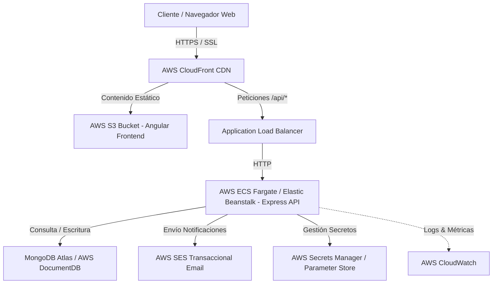

# Documento de Análisis Técnico y Propuesta de Arquitectura

Este documento contiene las respuestas de análisis técnico, diseño de base de datos, diagnóstico de incidentes de producción, arquitectura en Amazon Web Services (AWS), estrategia de migración sin downtime y controles de seguridad para la evaluación de **Alto Porte**.

---

## 📊 1. Base de Datos: MongoDB y Aggregation Pipeline

### 1.1 Estrategia de Índices para 2 Millones de Documentos

Si la colección de leads creciera a **2,000,000 de documentos**, la ejecución de filtros y ordenamientos sin índices provocaría escaneos completos de colección (_COLLSCAN_), consumiendo gigabytes de RAM y generando tiempos de respuesta superiores a los 10 segundos.

Se implementarían los siguientes índices compuestos y sencillos:

1. **Índice Compuesto Principal de Listado y Ordenamiento**:

   ```javascript
   db.leads.createIndex({ status: 1, createdAt: -1 });
   ```

   El filtro más frecuente es por `status`, combinado con el orden predeterminado por `createdAt` descendente. Aplica la regla ESR (_Equality, Sort, Range_).

2. **Índices Secundarios de Filtrado**:

   ```javascript
   db.leads.createIndex({ source: 1, createdAt: -1 });
   db.leads.createIndex({ project: 1, createdAt: -1 });
   db.leads.createIndex({ budget: -1 });
   ```

   Permiten resolver rápidamente búsquedas filtradas por proyecto u origen de canal y acelerar la ordenación por monto de presupuesto.

3. **Índice de Texto para Búsqueda Libre**:
   ```javascript
   db.leads.createIndex({ name: "text", email: "text" });
   ```
   Facilita búsquedas rápidas por coincidencia de texto en nombre y correo sin evaluar expresiones regulares complejas `$regex` que no aprovechan índices estándar.

---

### 1.2 Identificación de Consultas Lentas en Aggregation Pipeline

Para identificar pipelines con problemas de rendimiento:

1. **Uso de `.explain("executionStats")`**:
   Analizar el plan de ejecución de la consulta. Se revisan métricas clave:
   - `totalDocsExamined` vs `nReturned`: Si `totalDocsExamined` es 2,000,000 y `nReturned` es 10, hay un escaneo masivo ineficiente.
   - `stage`: Confirmar que el escenario sea `IXSCAN` (Scan de índice) y NO `COLLSCAN`.
2. **MongoDB Profiler y Slow Query Log**:
   Configurar el nivel de profiler en nivel 1 para registrar consultas que excedan 100ms:
   ```javascript
   db.setProfilingLevel(1, { slowms: 100 });
   ```
3. **Atlas Performance Advisor / CloudWatch Metrics**:
   Revisar métricas de lectura de disco, CPU y _Query Targeting Indexing Ratio_.

---

### 1.3 Acciones si el Dashboard Tardara Varios Segundos

Si el endpoint `GET /api/dashboard/summary` comenzara a degradarse por el volumen de datos:

1. **Optimización del Pipeline (\$match temprano)**:
   Asegurar que la etapa `$match` esté al inicio del pipeline para reducir la cantidad de documentos procesados por `$group`.
2. **Vistas Materializadas / Pre-Agregaciones ($merge)**:
   Crear un proceso en segundo plano (cronjob o triggers con MongoDB Change Streams) que calcule los totales de `byStatus`, `bySource`, `byProject` cada N minutos y actualice una colección secundaria `dashboard_summaries`.
3. **Capa de Caching con Redis**:
   Almacenar en caché el JSON del resumen en Redis con un TTL de 5 a 15 minutos. El endpoint respondería en menos de 5ms directamente desde memoria RAM.

---

### 1.4 Embebidos vs Referencias entre Colecciones

| Criterio        | Documentos Embebidos                                                                                                         | Referencias entre Colecciones (`$lookup` / ID)                                                                      |
| :-------------- | :--------------------------------------------------------------------------------------------------------------------------- | :------------------------------------------------------------------------------------------------------------------ |
| **Cuándo usar** | Relaciones 1:1 o 1:N acotadas (ej. Historial de estados de un lead, notas de seguimiento). Datos que siempre se leen juntos. | Relaciones N:M o 1:N de crecimiento indefinido (ej. Catálogo de Proyectos, Agentes de Venta, Historial de correos). |
| **Ventajas**    | Operaciones atómicas en un solo documento. Lecturas ultra rápidas sin JOINs.                                                 | Evita la duplicación de datos. Reduce el tamaño del documento evitando sobrepasar el límite BSON de 16MB.           |
| **Desventajas** | Posible duplicación si la entidad cambia (ej. cambiar nombre del proyecto).                                                  | Requiere consultas adicionales o uso de `$lookup` que incrementa la latencia en grandes volúmenes.                  |

---

## 🛠️ 2. Diagnóstico de un Incidente de Producción

### Escenario

_Los usuarios reportan que el dashboard, que antes cargaba casi de inmediato, ahora tarda entre 8 y 12 segundos._

### Investigación Paso a Paso

#### Paso 1: Recopilación de Información Previa (Sin modificar código)

- **Verificar alcance**: ¿Afecta a todos los usuarios o solo a un rol/región?
- **Identificar ventana temporal**: Revisar cuándo comenzó el problema (¿coincide con un despliegue reciente o incremento de tráfico?).
- **Revisar métricas globales**: Consultar el estado de la infraestructura en AWS CloudWatch (CPU, Memoria, IOPS de disco en MongoDB Atlas).

#### Paso 2: Aislamiento del Cuello de Botella

Utilizar la regla de aislamiento de capas:

1. **Frontend (Browser / Angular)**: Medir en Chrome DevTools (Tab _Network_) el tiempo de **TTFB** (_Time to First Byte_) vs tiempo de renderizado en DOM. Si TTFB es de 10s, el problema es servidor/red; si TTFB es 50ms pero la pestaña se congela 10s, el problema es en el ciclo de detección de cambios de Angular.
2. **Backend API (Node.js)**: Revisar los logs de Express con marcas de tiempo (middleware de logging como `morgan` o APM Datadog) para aislar la duración de la ruta `/api/dashboard/summary`.
3. **Base de Datos (MongoDB)**: Ejecutar `db.currentOp()` para ver consultas activas bloqueantes y revisar el _Slow Query Log_.

#### Paso 3: Logs, Métricas y Herramientas Utilizadas

- **Herramientas de APM**: Datadog, New Relic o AWS X-Ray para rastreo distribuido (_Distributed Tracing_).
- **Logs de Node.js**: Verificar si el bucle de eventos (_Event Loop_) está bloqueado con métricas de `libuv`.
- **MongoDB Tools**: `mongostat`, `mongotop` y `.explain("executionStats")`.

#### Paso 4: Identificación de Causa Raíz

- Evitar corregir síntomas (ej. no reiniciar el servidor sin investigar).
- **Causas raíz probables**:
  - Falta de índice en campos del Aggregation Pipeline tras superar 1 millon de registros.
  - Procesamiento masivo de registros en memoria dentro de Node.js en lugar de delegar la agregación a MongoDB.
  - _Memory leak_ en Angular por suscripciones de RxJS no canceladas que saturan el navegador tras horas de uso.

#### Paso 5: Validación de la Mejora y Prevención

- **Pruebas de Carga**: Realizar pruebas de estrés con **k6** o **JMeter** simulando la concurrencia en un ambiente de Staging.
- **Validación de Latencia**: Confirmar que el P95 de la ruta sea inferior a 300ms.
- **Medidas Preventivas**: Crear una alerta en CloudWatch / Datadog cuando la respuesta del endpoint supere los 1,000ms.

#### Paso 6: Comunicación a Partes No Técnicas

- **Formato de Comunicación**:
  > _"Identificamos la causa de la lentitud en el dashboard comercial: debido al crecimiento exitoso en el volumen de leads, las consultas requerían una reestructuración de índices en la base de datos. Se aplicó una optimización de índices y almacenamiento en caché que redujo el tiempo de respuesta de 10 segundos a menos de 0.3 segundos. Hemos implementado alertas automáticas para asegurar que no vuelva a ocurrir."_

---

## ☁️ 3. AWS y Estrategia de Migración

### 3.1 Arquitectura Propuesta en AWS



#### Servicios Elegidos y Justificación Technical

1. **S3 y CloudFront (Frontend Estático)**:
   - **Por qué sí**: Servir la aplicación Angular distribuida globalmente en puntos de presencia (_Edge Locations_) reduce la latencia a milisegundos y minimiza costos de cómputo en servidores.
2. **AWS ECS Fargate / Elastic Beanstalk (Backend API)**:
   - **Por qué sí**: Permite ejecutar contenedores Docker de Node.js con auto-escalado horizontal automático según uso de CPU/RAM, garantizando alta disponibilidad sin administrar servidores físicos.
3. **AWS SES (Simple Email Service)**:
   - **Por qué sí**: Servicio altamente confiable y económico para envío de correos transaccionales (confirmaciones de leads, alertas a ejecutivos).
4. **AWS Secrets Manager & IAM**:
   - **Por qué sí**: Garantiza que las credenciales de la base de datos y llaves API no estén escritas en duro (_hardcoded_), inyectándolas de forma segura en las variables de entorno del contenedor.
5. **AWS CloudWatch**:
   - **Por qué sí**: Centralización de logs de aplicación, alarmas por tasa de errores HTTP 5xx y monitoreo de salud.
6. **MongoDB Atlas / DocumentDB (Base de Datos)**:
   - **Por qué sí**: Clusters en Replica Set multi-zona con _Point-in-Time Recovery_ (PITR) y copias de seguridad automáticas diarias.

---

### 3.2 Plan de Migración (Estrategia Cero Downtime)

#### 1. Fase Previa (Antes de la Migración)

- Inventariar dominios DNS, certificados SSL, variables de entorno y buckets actuales.
- Desplegar la infraestructura destino en AWS mediante Terraform o CloudFormation.
- Configurar réplicas de datos iniciales en el nuevo cluster de MongoDB.

#### 2. Fase de Migración (Durante la Ventana de Cambio)

- Reducir el TTL del registro DNS a 60 segundos.
- Sincronizar datos delta finales de la base de datos antigua a AWS.
- Cambiar el puntero DNS en Route 53 hacia CloudFront / ALB.
- Monitorear el tráfico mediante CloudWatch logs.

#### 3. Fase Posterior (Después de la Migración)

- Ejecutar suite de pruebas de humo (_Smoke Tests_) funcionales en producción.
- Verificar el envío de correos transaccionales y el estado de la BD.
- Revocar credenciales y accesos en las cuentas de los proveedores anteriores de forma ordenada.

#### 4. Plan de Rollback

- Si se detectan fallos críticos insalvables en los primeros 30 minutos: apuntar el DNS Route 53 de vuelta a los servidores originales.

---

## 🔒 4. Seguridad, Pruebas y Criterio Técnico

### 4.1 Matriz de 6 Controles de Seguridad Pre-Producción

| Riesgo                                       | Medida Propuesta                                                                                                        | Resultado Esperado                                                           |
| :------------------------------------------- | :---------------------------------------------------------------------------------------------------------------------- | :--------------------------------------------------------------------------- |
| **1. Inyección NoSQL y XSS**                 | Sanitización de entradas en DTOs de Express utilizando `express-mongo-sanitize` y `validator`. Escapar HTML en Angular. | Prevención total de consultas maliciosas y ejecución de scripts arbitrarios. |
| **2. Fuga de Secretos y Credenciales**       | Uso de AWS Secrets Manager y archivo `.env` fuera del control de versiones (`.gitignore`).                              | Eliminación de credenciales expuestas en repositorios de código.             |
| **3. Ataques por Fuerza Bruta / DoS**        | Implementación de `express-rate-limit` (ej. máx. 100 peticiones por 15 min por IP).                                     | Protección del servidor ante saturación maliciosa de peticiones.             |
| **4. Peticiones de Orígenes No Autorizados** | Configuración estricta del middleware `cors` limitando orígenes permitidos al dominio del frontend.                     | Bloqueo de solicitudes de sitios maliciosos desde el navegador del cliente.  |
| **5. Vulnerabilidad en Dependencias**        | Ejecución de `npm audit` y escaneo automatizado con Snyk en el pipeline de CI/CD.                                       | Mitigación activa de vulnerabilidades conocidas en librerías de terceros.    |
| **6. Tránsito de Datos No Cifrado**          | Obligar HTTPS mediante certificados SSL/TLS emitidos por AWS Certificate Manager (ACM).                                 | Cifrado punto a punto en todas las comunicaciones del usuario.               |

---

### 4.2 Revisión Crítica de la Solución

1. **¿Cuál considera que es el principal riesgo técnico de la solución entregada?**
   - El acoplamiento del frontend con la simulación de mock fallback si no se deshabilita explícitamente en el entorno de producción (`environment.prod.ts`), lo que podría enmascarar errores de red si el backend fallara.
2. **¿Qué parte refactorizaría primero si tuviera un día adicional?**
   - Implementaría un módulo central de gestión de estado en Angular con RxJS `BehaviorSubject` / State Pattern dedicado para desacoplar totalmente la comunicación de la tabla y los filtros del componente principal.
3. **¿Qué decisión tomó por el límite de tiempo y cuál sería la alternativa ideal?**
   - _Decisión tomada_: Implementar una arquitectura ligera con servicios RxJS directos y modales con HTML/CSS nativo.
   - _Alternativa ideal_: Implementar Angular Material o PrimeNG con CDK Virtual Scroll para renderizar tablas de más de 100,000 filas sin impacto en rendimiento del DOM.
4. **¿Qué monitoreo y alertas dejaría configurados para la primera semana en producción?**
   - Alerta en CloudWatch por errores 5xx > 1% en 5 minutos.
   - Alerta de latencia P95 > 1,000ms en endpoints clave (`/dashboard/summary`).
   - Notificación instantánea por Slack / Email ante excepciones no capturadas (_Unhandled Exceptions_).
